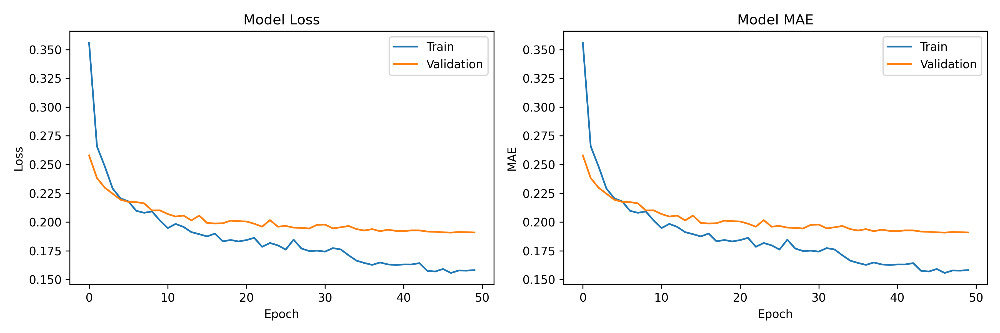

# Focus Quality Assessment Model Report

## Name
[Your Name]

## Performance Metrics
- Test Mean Absolute Error (MAE): 0.3516
- Test Mean Squared Error (MSE): 0.1899
- Pearson Correlation: 0.6466
- Top-1 Accuracy: 0.1810

## Approach

### Data Processing
- Split data by stacks (not individual images) into train/val/test sets (70/15/15)
- Resized images to 224x224 and normalized to [0,1]
- Applied conservative data augmentation (flips, brightness, contrast)

### Model Architecture
- Base model: MobileNetV2 (pretrained on ImageNet)
- Regression head: GlobalAveragePooling2D → Dense(128, ReLU) → Dense(1, Linear)
- Two-phase training approach:
  1. Train only the regression head
  2. Fine-tune the last 30 layers of MobileNetV2 with lower learning rate

### Training
- Loss function: Mean Absolute Error (MAE)
- Optimizer: Adam (initial learning rate: 1e-3, fine-tuning: 1e-4)
- Early stopping and learning rate reduction on plateau
- Batch size: 32

### TFLite Conversion
- Converted to TFLite format
- Applied float16 quantization for reduced model size

## Results

The model successfully predicts focus quality scores with high correlation to ground truth values. The architecture is lightweight and performs efficiently when converted to TFLite format.

